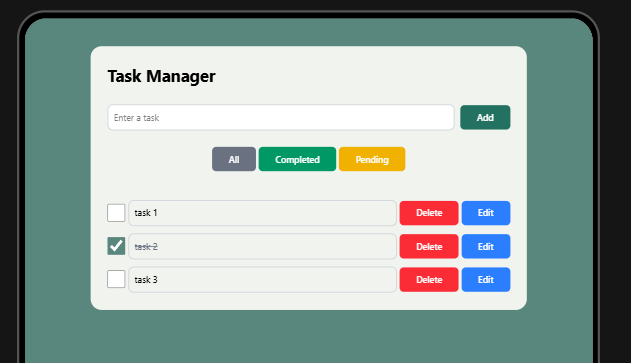
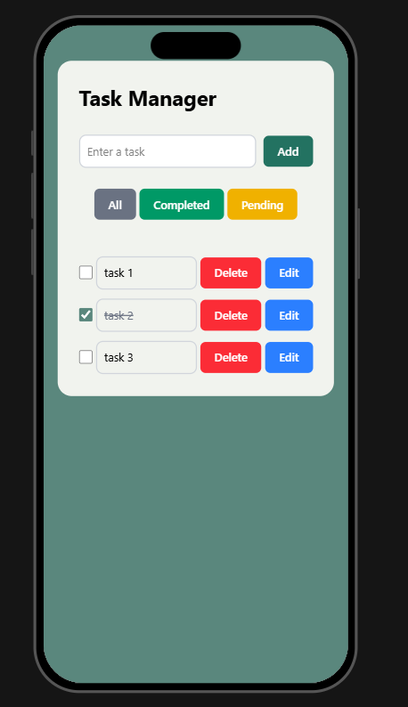

# Task Manager App

##  Mô tả
**Task Manager App** là một ứng dụng quản lý công việc, được xây dựng bằng **React 19** với sự hỗ trợ của **Vite** để tối ưu hóa tốc độ phát triển và build dự án.  
Giao diện được thiết kế bằng **TailwindCSS 4.1.4**, kết hợp cùng **clsx** và **tailwind-merge** để tối ưu hóa việc xử lý className một cách đơn giản và linh hoạt.  
Ứng dụng sử dụng **Zustand** để quản lý trạng thái (state management) hiệu quả và dễ mở rộng.  
Bên cạnh đó, **TypeScript** giúp đảm bảo độ ổn định, an toàn và dễ maintain cho codebase.  
Dữ liệu công việc (task) được lưu trữ trên **LocalStorage** để đảm bảo tính liên tục khi tải lại trang.


## Hướng dẫn cài đặt

### Yêu cầu môi trường
- **Node.js** phiên bản `>= 18.x`
- **npm** phiên bản `>= 9.x` (hoặc sử dụng **yarn** / **pnpm**)

### Các bước cài đặt

1. Clone repository:
   ```bash
   git clone https://github.com/your-username/task-manager-app.git
   cd task-manager-app
2. Cài dặt dependencies:
   ```bash
   npm install
   ```
3. Chạy lệnh dev:
   ```bash
   npm run dev
   ```
4. Mở trình duyệt và truy cập vào `http://localhost:5173`

### Cấu trúc thư mục
├── README.md
├── package.json
├── src
│   ├── components
│   │   ├── hooks
│   │   │   └── useTaskManagerStore.ts
│   │   ├── layout
│   │   ├── ui
│   │   │   ├── Button.tsx
│   │   │   ├── Input.tsx
│   │   │   ├── TaskItem.tsx
│   │   │   ├── TaskList.tsx
│   │   │   └── index.ts
│   │   ├── utils
│   │   │   └── localStorage.ts
│   ├── configs
│   ├── routes
│   ├── enums
│   ├── pages
│   │   ├── TaskManager 
│   │   │   ├── TaskManager.tsx
│   │   └── index.ts
│   ├── services
│   │   ├── TaskService.ts
│   ├── stores
│   │   ├── useTaskManagerStore.ts
│   ├── types
│   │   └── task.type.ts
│   ├── index.tsx
│   └── main.tsx
├── App.tsx
├── main.tsx

# Các chức năng chính của dự án
- Tạo, xóa, sửa các task
- Hiển thị danh sách các task
- Lọc task theo trạng thái (completed, pending)
- Thay đổi trang thái task

## Giao diện
### Giao diện desktop

### Giao diện tablet

### Giao diện mobile


